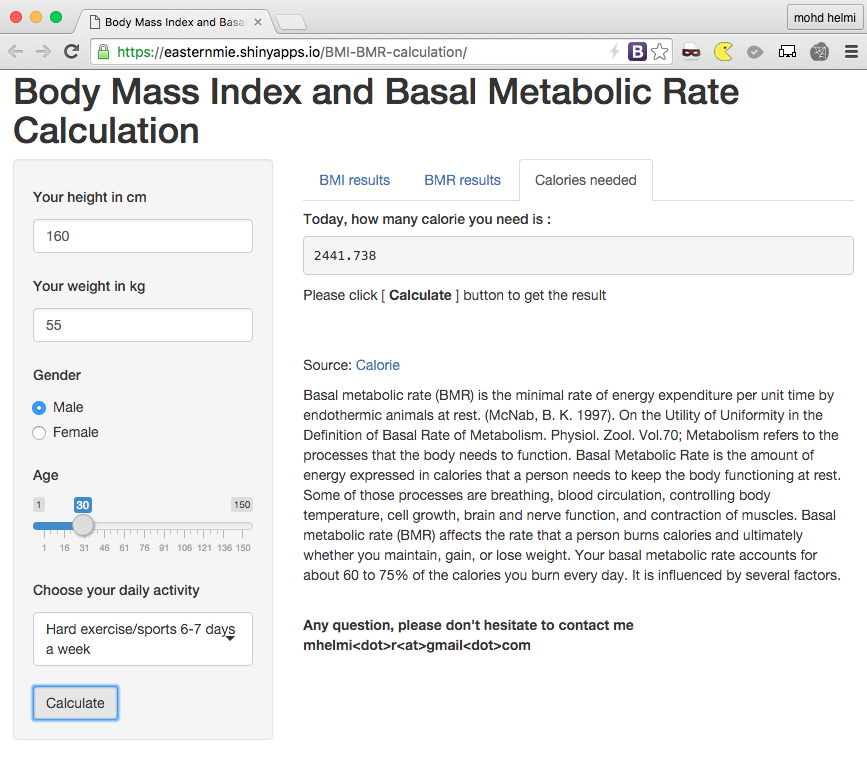

## Intro

This Body Mass Index (BMI) and Basal Metabolic Rate (BMR) Calculation is an app to guide user know their BMI and BMR. The information is useful to guide user plan their daily diet.

BMI, or body mass index, is a statistical measurement of a person’s body weight that is based on both weight and height. It is used to determine what a person’s ideal weight is.

BMR refers to a person’s Basal Metabolic Rate, or the number of calories a person would burn in a day even if he or she did nothing but sit or lie in one place.

--- .class #id 

## Shiny App

    <table>
    <tr><td></td></tr>
    <tr><td><a target="_blank" href="http://easternmie.shinyapps.io/BMI-BMR-calculation">http://easternmie.shinyapps.io/BMI-BMR-calculation</a></td></tr>
    </table>

```r
funcBMI(input$weight,input$height){
    if (wght==0 | hght==0) return(NA) 
    else  return(round(wght/(hght/100)^2,1))
}
```

```r
funcBMR(weight,height,gender,age) {
    if (gender=="Female") return(655 + ( 9.6 * weight ) + ( 1.8 * height ) - ( 4.7 * age )) 
    else  return(66 + ( 13.7 * weight ) + ( 5 * height) - ( 6.8 * age))
}
```

```r
funcClassBMI(bmi) {
    if (is.na(bmi)) return ("")
    else {
        if (bmi<18.5) return("Your BMI is less than [18.5] you are considered UNDERWEIGHT") 
        if (bmi>=18.5 & bmi<=24.9) return("Your BMI is in range [18.5] to [24.9] you are in HEALTHY WEIGHT RANGE")
        if (bmi>=25 & bmi<=29.9) return("Your BMI is in range [25] to [29.9] you are OVERWEIGHT")
        if (bmi>=30 & bmi <=34.9) return("Your BMI is in range [30] to [34.9] you are CLASS 1 OBESITY")
        if (bmi>=35 & bmi <=39.9) return("Your BMI is in range [35] to [39.9] you are CLASS 2 OBESITY")
        if (bmi>=40) return("Your BMI is higher than [40] you are CLASS 3 OBESITY")
    }
}
```

```r
funcCal(bmr,activity) {
    if (activity=="Little or no exercise") return(bmr * 1.2) 
    else if (activity=="Light exercise/sports 1-3 days/week") return(bmr * 1.375)
    else if (activity=="Moderate exercise/sports 3-5 days/week") return(bmr * 1.55)
    else if (activity=="Hard exercise/sports 6-7 days a week") return(bmr * 1.725)
    else if (activity=="Very hard exercise/sports & physical job") return(bmr * 1.9)
}
```
---

## ui.R

- This UI deivided into two layout :
1. sidebarPanel
2. mainPanel

- sidebarPanel contains all user input control which is controled by tab. Every tab has different input control.
- mainPanel contain tabsetPanels. 3 tab separated to display result BMI, result BMR and Calories needed by user.
---

## server.R

- process the user input every time Calculate button pressed.
- server.R have 4 unique function which is :
    - funcBMI (), accepting two variable which is height and weight.

    - funcClassBMI (), accepting only one variable which is BMI.
    - funcBMR (), accepting 4 variable which is height, weight, age and gender.
    - funcCal (), accepting two variable which is BMR and daily active rate.
---

## Features

Calories calculated in "Calorie needed" is to guide user to have their daily meal. For example, if calorie need is 1698.6, he/she cannot eat "PECAN PIE 1 PIE" and many more. Refer http://www.myfoodbuddy.com/foodCalorieTable.htm
